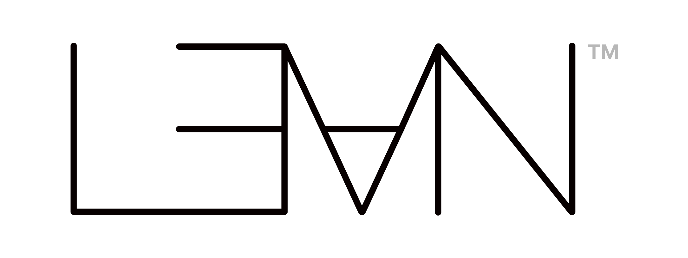

# Lean Kernel Challenge

*A multi-stage competition on improving the performance of verified computation
in the Lean 4 kernel.*

## Co-organizers

Stage 1 is co-organized by (in alphabetical order by surname):

- Joachim Breitner
- Leonardo de Moura
- Kim Morrison
- Terence Tao

The co-organizing institutions are [Lean FRO](https://lean-fro.org/) and the
[SAIR Foundation](https://sair.foundation/).

  
  &nbsp;&nbsp;&nbsp;&nbsp;
  

## Background

The Lean Kernel Challenge brings the community together to develop faster algorithms
and better representations for verified computation. Through these collective
contributions, the competition aims to support Lean's development and benefit
Lean users worldwide.

Verified computation uses the Lean kernel to check computational results as part
of a proof. Stage 1 is the first, experimental stage of the series, beginning with
fundamental problems. Later stages will cover a broader range of mathematical and
scientific fields and more complex problems.

The Lean Kernel Challenge is inspired by the
[Lean Kernel Arena](https://github.com/leanprover/lean-kernel-arena), and we thank
its contributors. Lean Kernel Arena benchmarks alternative Lean proof checkers;
the Lean Kernel Challenge focuses on algorithms and representations for verified
computation, beginning in Stage 1 with fixed tasks evaluated by a fixed Lean kernel.

## Problems

Stage 1 has eight problems covering algebra, number theory, combinatorics,
cryptography, and discrete mathematics. Each has a fixed Lean specification.

Find [statements and test groups](problems/README.md) in `rules/problems/`,
[starter templates](../problems/) in `problems/`, and
[one complete example per problem](../examples/README.md) at
`examples/<problem>/Submission.lean`.

## Submission

For each problem, submit one **`Submission.lean`** file (at most **1 MiB**) with:

- `impl`: your algorithm.
- `impl_correct`: a complete Lean proof that it matches the specification for every input.

Keep the [required interface](problems/README.md#submission) and helpers in
`namespace Submission`; leave fixed files unchanged. See the
[quick start](../README.md#quick-start).

You may update formal submissions before the cutoff. For each team and problem,
the latest formal entry by recorded submission time is selected, not the best result.
Rejected, unscored, or failed entries do not restore older submissions;
post-deadline entries cannot replace the selection.

## Rules

- **R1 — Format.** Submit only `Submission.lean`; do not modify fixed workspace files.
  Submitted code must be human-readable. Compressed data and bytecode are not allowed.
- **R2 — Computation.** Use only locked dependencies and a total implementation
  that kernel-reduces to its output literal. `partial` and `unsafe` are prohibited.
- **R3 — Correctness.** Prove `∀ n, impl n = spec n` in Lean; passing tests is not enough.
- **R4 — Proof restrictions.** `sorry`, `admit`, `native_decide`, and unapproved
  axioms cause rejection.
- **R5 — Ranking.** Only computation instruction counts affect rank.

Well-founded recursion, alternative algorithms and representations, hardcoded
tables, and special cases are allowed if they satisfy these rules and the
[resource limits](problems/README.md#limits). Inputs follow each problem's published policy.

## Evaluation

A submission is **Accepted** when its interface, universal proof, and axiom checks
pass. Each problem has its own leaderboard: report each case's median computation
instruction count over three kernel replays, then rank complete passes by their
sum, lowest first; equal totals tie. Correctness replay is reported separately
for verification only. Incomplete verification or any failed case means no complete
total or rank.

Daily standings publish only complete provisional editions; final evaluation runs
separately after the deadline. See [Evaluation](evaluation.md) for measurement,
environment, limits, and local setup. Official use requires
[deployment and host validation](../evaluation/maintainers.md);
local wall-time results are not official rankings.

## Key Dates

- Stage 1 registration and team formation open: **August 26, 2026**
- Stage 1 official launch: **September 15, 2026**
- Stage 1 submission deadline: **November 20, 2026, 23:59 AoE (UTC−12)**
- Stage 2 begins: **December 2026**; the exact date will be announced

## Registration & Teams

Register individually or as a team on [SAIR](https://competition.sair.foundation/).
Participants must have a SAIR account, complete the required profile information,
and agree to the SAIR competition terms before registering for Stage 1.

## Official Repository & Playground

The official repository is
[SAIRcompetition/lean-kernel-challenge](https://github.com/SAIRcompetition/lean-kernel-challenge).
The SAIR Playground and submission system open together on
[SAIR](https://competition.sair.foundation/) at the Stage 1 official launch.
Playground runs and edits do not constitute or replace a formal submission.

Playground Standard mode allows **2 runs per day**, resetting at 00:00 UTC.
Before launch, organizers will clarify whether this limit applies per team or
per team/problem, whether formal submissions share the Standard allowance, and
how failures or cancellations affect usage.

## Team Participation and Anti-Cheating Policy

- Each individual or organization can participate in only one team.
- Teams must register members and sponsors in advance.
- If coordinated cheating is detected (including sockpuppet teams), all related teams will be disqualified.

## Experimental Status

Stage 1 of the Lean Kernel Challenge is experimental. Participants are
responsible for any computing costs they incur while developing, testing,
submitting, or otherwise participating in Stage 1. The co-organizers do not
reimburse these costs.

## Community Feedback

Community feedback and contributions are welcome. Join the
[SAIR Foundation Zulip community](https://zulip.sair.foundation/) for discussion
and collaboration.
