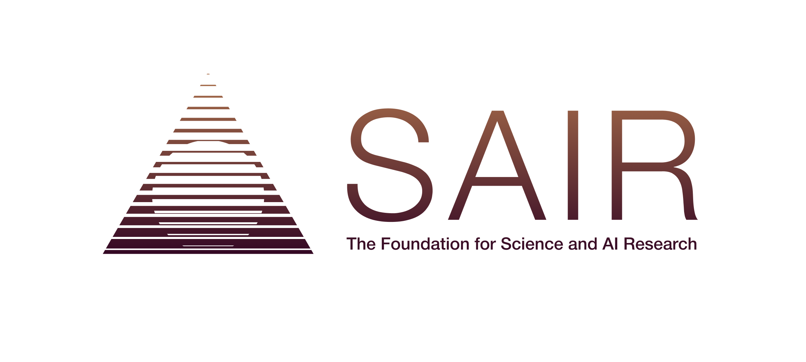

# Lean Kernel Challenge — Stage 1

*Stage 1 of a multi-stage competition on improving the performance of verified
computation in the Lean 4 kernel.*

## Co-organizers

Stage 1 of the Lean Kernel Challenge is co-organized by (in alphabetical order
by surname):

- Joachim Breitner
- Leonardo de Moura
- Kim Morrison
- Terence Tao

The co-organizing institutions are [Lean FRO](https://lean-fro.org/) and the
[SAIR Foundation](https://sair.foundation/).

  
  &nbsp;&nbsp;&nbsp;&nbsp;
  

## Background

The Lean Kernel Challenge is a competition series that brings the Lean
community together to improve the performance of verified computation in the
Lean kernel.

Stage 1 is the first, experimental stage of the series. It begins with a set of
fundamental computational problems. Later stages will cover a broader range of
mathematical fields and more complex problems.

The Lean 4 kernel is the trusted component that checks every proof accepted by
Lean. It checks definitional equality by reducing expressions; when a proof
depends on a computed result, that computation becomes part of proof
verification.

After each evaluation cohort closes, all results and benchmark data from that
cohort will be released publicly under an open license. Together with the
algorithms and representations developed through the challenge, this open
record will support the Lean community, contribute to Lean's continued
development, and allow Lean users worldwide to reproduce, reuse, and build on
the community's work.

## Task

For each problem, the organizers provide a trusted Lean specification.
Participants submit:

1. an implementation optimized for kernel verification; and
2. a machine-checked proof that the implementation agrees with the
   specification on every input.

The judge first checks the proof of correctness for all inputs. Scoring
measures the work performed by a pinned Lean kernel when replaying the complete
verified correctness artifact and the generated checks for judge-selected
inputs.

The problem set spans areas of computational mathematics including algebra,
number theory, combinatorics, cryptography, and discrete mathematics. Specific
problems will be announced at the official launch.

## Key Dates

- Registration and team formation open: **August 26, 2026**
- Official launch: **September 15, 2026, 12:00 UTC**
- Submission deadline: **November 15, 2026, 23:59 AoE (UTC−12)**

## Registration & Teams

Registration and team management take place on
[SAIR](https://competition.sair.foundation/). Participants must have a SAIR
account, complete the required profile information, and agree to the SAIR
competition terms before registering. They may compete individually or form a
team on SAIR.

## Official Repository & Playground

The official repository, SAIR Playground, and submission system will become
available at the official launch.

## Experimental Status and Participant Costs

Stage 1 of the Lean Kernel Challenge is experimental. Participants are
responsible for any computing costs they incur while developing, testing,
submitting, or otherwise participating in Stage 1. The co-organizers do not
reimburse these costs.

## Team Participation and Anti-Cheating Policy

- Each individual may participate only once, either individually or as a member
  of one team. Each organization may participate through only one team.
- Teams must declare all members and any team sponsors through the registration
  process before their first submission.
- If coordinated cheating is detected, including through sockpuppet teams, all
  related teams will be disqualified.

## Community Feedback

Community feedback and contributions are welcome. Join the
[SAIR Foundation Zulip community](https://zulip.sair.foundation/) for discussion
and collaboration.
